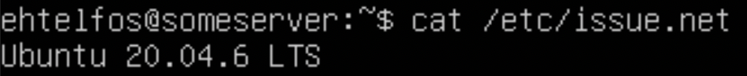
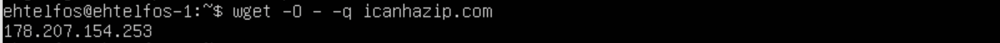
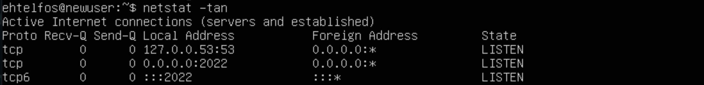

## Part 1. Установка ОС

- Установим Ubuntu 20.04 Server LTS без графического интерфейса. Далее выполним команду `cat /etc/issue.net`, чтобы узнать версию Ubuntu. 
 

## Part 2. Создание пользователя

- Создадим нового пользователя и добавим в группу adm, используя команду `sudo useradd -g adm new_user`. 
 

- Вывод команды `cat /etc/passwd` 
 

## Part 3. Настройка сети ОС

- Сменим название машины на user-1: `sudo nano /etc/hostname`. 
 
Сделаем `reboot` и проверим 
 

- Установка временной зоны при помощи команды `dpkg-reconfigure tzdata`. 
 

- Вывод названий сетевых интерфейсов: `ip addr show`. 
lo (local loopback) используется для того, чтобы компьютер мог обращаться к самому себе и имеет по умолчанию ip-адрес 127.0.0.1 на всех компьютерах. 
 

- Получение ip-адреса устройства от DHCP сервера: `hostname -I`. 
DHCP - Dynamic Host Configuration Protocol - протокол, использующийся для автоматического выставления различной конфигурации, в том числе IP-адресов. 
 

- Внешний ip-адрес шлюза (ip): `wget -O - -q icanhazip.com`. 
 

- Внутренний IP-адрес шлюза, он же ip-адрес по умолчанию (gw): `ip route show | grep default | awk '{print $3}'`. 
 

- Установка статичных настроек ip, gw, dns используя `sudo vim /etc/netplan/00-installer-config.yaml`. 
 

- Пингование удаленных хостов 1.1.1.1 и ya.ru прошло успешно. 
 
 

## Part 4. Обновление ОС

- Воспользуемся двумя командами. Команда `apt update` обновляет индекс пакетов в системе Linux или списки пакетов. Команда `apt upgrade` обновляет пакеты программного обеспечения до последних версий. 

Проверим 
 
 

## Part 5. Использование команды **sudo**

- `sudo` - (substitute user and do) позволяет строго определенным пользователям выполнять указанные команды с административными привилегиями. 
- Смена hostname от имени пользователя, созданного в пункте Part2. 
 

## Part 6. Установка и настройка службы времени

- Для синхронизации времени используем команду `sudo timedatectl set-ntp 1`. Для отключения вместо 1 ставим 0. 
Вывод команды `timedatectl show`, показывающей время часового пояса. 
 

## Part 7. Установка и использование текстовых редакторов 

- Команды для установки текстовых редакторов VIM, NANO и JOE. 
`sudo apt install vim` 
`sudo apt install nano` 
`sudo apt install joe` 
- VIM: для выхода с сохранением изменений нажал ESC и набрал команду `:wq test_VIM.txt`. 
 
- NANO: для выхода с сохранением изменений нажал Ctrl + O, ввёл test_NANO.txt, нажал Ctrl + X. 
 
- JOE: для выхода с сохранением изменений нажал Ctrl + K + X, ввёл test_JOE.txt. 
 

- VIM: для выхода без сохранения изменений нажал ESC и набрал команду `:q!`. 
 
- NANO: для выхода без сохранения изменений нажал Ctrl + X и N. 
 
- JOE: для выхода без сохранения изменений нажал Ctrl + C и y. 
 

- VIM: поиск: `/слово(необезательно) для поиска` 
 
- VIM: замена: `:s/что заменить/на что` 
 

- NANO: поиск: `Ctrl + W` 
 
- NANO: замена: `Ctrl + \, [что заменить] [на что], Y` 
 

- JOE: поиск: `Ctrl + K, F, что найти, I` 
 
- JOE: замена: `Ctrl + K, F, что заменить, R, на что, Y` 
 

## Part 8. Установка и базовая настройка сервиса **SSHD**

- Установил службу SSHd. 
`sudo apt-get install ssh` 
`sudo apt install openssh-server` 
 

- Добавил автостарт службы при загрузке системы. 
`sudo systemctl enable ssh` 
`systemctl status ssh` 
 

- Перенастроил службу SSHd на порт 2022. 
Ввёл команду: `sudo vim /etc/ssh/sshd_config`, чтобы отредактировать файл конфигурации службы SSHd, нашёл строку, содержащую порт SSH и изменил значение порта на 2022. 
 
Перезапустил службу SSHd для применения новых настроек: `sudo systemctl restart sshd`. 

- Показать наличие процесса sshd можно используя команду `ps -C sshd`. 
 
`ps` - команда для получения информации о текущих процессах. 
`-C` - ключ для фильтрации вывода процессов по имени команды (названию процесса). В данном случае, мы указываем sshd как имя команды для фильтрации. 

- Перезагрузил систему, используя команду `sudo reboot`. 

- Вывод команды `netstat -tan`. 
 
Ключ `-t` или `--tcp` отображает только TCP-соединения в выводе netstat. 
Ключ `-a` или `--all` отображает все активные подключения TCP, включая слушающие порты. 
Ключ `-n` или `--numeric` выводит активные подключения TCP, отображая адреса и номера портов в числовом формате, а не в виде FQDN (Fully Qualified Domain Name) и имен сервисов. 
Proto: Указывает на название протокола, является ли это TCP или UDP. 
Recv-Q: Очередь получения, отображающая количество непрочитанных байтов, ожидающих чтения. 
Send-Q: Очередь отправки, отображающая количество байтов, ожидающих отправки. 
Local Address: Адрес локального компьютера и используемый номер порта для данного соединения. 
Foreign Address: Адрес и номер удаленного компьютера, к которому подключен данный сокет. 
State: Состояние сокета, показывающее, находится ли соединение в активном, ожидающем, закрытом или другом состоянии. 
Значение в столбце Local Address равно 0.0.0.0, это означает, что прослушивается IP-адрес на локальной машине для указанного порта. 

## Part 9. Установка и использование утилит **top**, **htop**

- Установил и запустил утилиту top 
uptime - 14; 
количество авторизованных пользователей - 1; 
общую загрузку системы - 0.00, 0.01, 0.03; 
общее количество процессов - 96; 
загрузку cpu - 0.3%; 
загрузку памяти - 159.7/1971.4; 
pid процесса занимающего больше всего памяти - 1207, команда: `top -o %MEM`; 
pid процесса, занимающего больше всего процессорного времени - 638, команда: `top -o %CPU`; 

- htop сортировка по PID 
 
- htop сортировка по PERCENT_CPU 
 
- htop сортировка по PERCENT_MEM 
 
- htop сортировка по TIME 
 
- скрин с выводом команды htop отфильтрованному для процесса sshd 
 
- скрин с выводом команды htop с процессом syslog, найденным, используя поиск 
 
- скрин с выводом команды htop с добавленным выводом hostname, clock и uptime 
 

## Part 10. Использование утилиты **fdisk**

- Запуск команды `sudo fdisk -l`. 
 
название жесткого диска - vbox harddisk; 
размер - 25GiB; 
количество секторов - 52428800. 

- Запуск команды `sudo swapon --show`. 
 
размер swap - 2G. 

## Part 11. Использование утилиты **df** 

- Запустил команду `df`. 
 
размер раздела - 11758760; 
размер занятого пространства - 4775812; 
размер свободного пространства - 6363840; 
процент использования - 43; 
Определить и написать в отчёт единицу измерения в выводе - KB. 

- Запустил команду `df -Th`. 
 
размер раздела - 12G; 
размер занятого пространства - 4.6G; 
размер свободного пространства - 6.1G; 
процент использования  - 43; 
Тип файловой системы для раздела - ext4. 

## Part 12. Использование утилиты **du**

- Запустил команду `du`. 
 
q
- Размер папок /home, /var, /var/log (в байтах), команда: `sudo du -s /var/log /home /var` 
 

- Размер папок /home, /var, /var/log (в человекочитаемом виде), команда: `sudo du -sh /var/log /home /var` 
 

- Размер всего содержимого в /var/log, команда: `sudo du -sh /var/log/*` 
 

## Part 13. Установка и использование утилиты **ncdu**

- Установил утилиту ncdu .
`sudo apt-get install ncdu` 
 

- Размеры папок /home, /var, /var/log. 
 
 
 

## Part 14. Работа с системными журналами

- Команды для открытия: 
`sudo vim /var/log/dmesg`      
`sudo vim /var/log/syslog`           
`sudo vim /var/log/auth.log` 

- Время последней успешной авторизации, имя пользователя и метод входа в систему: 
`(15:07:44; ehtelfos by LOGIN)` 

- Перезапуск службы SSHd. 
`sudo systemctl restart ssh` 

- Сообщениее о рестарте службы. 
 

## Part 15. Использование планировщика заданий **CRON**

- Используя планировщик заданий, запустил команду uptime через каждые 2 минуты. 
 

- Строчки в системном журнале о выполнении. 
 

- Список текущих заданий для CRON 
 

- Удалил все задания из планировщика заданий, скрин со списком текущих заданий для CRON. 
 
